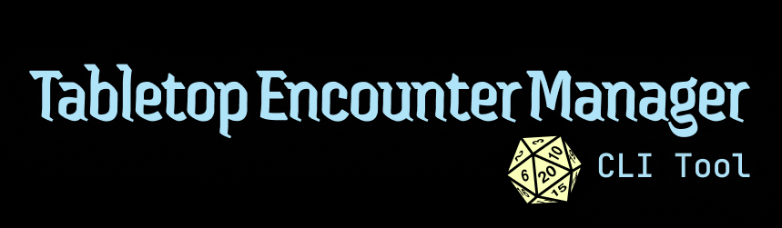

# Tabletop Encounter Manager

A CLI tool for managing tabletop encounters, designed with D&D encounters in mind.

## Credits

Banner [D20](https://game-icons.net/1x1/delapouite/dice-twenty-faces-twenty.html) icon by Delapouite, Licensed under [CC BY 3.0](https://creativecommons.org/licenses/by/3.0/)

